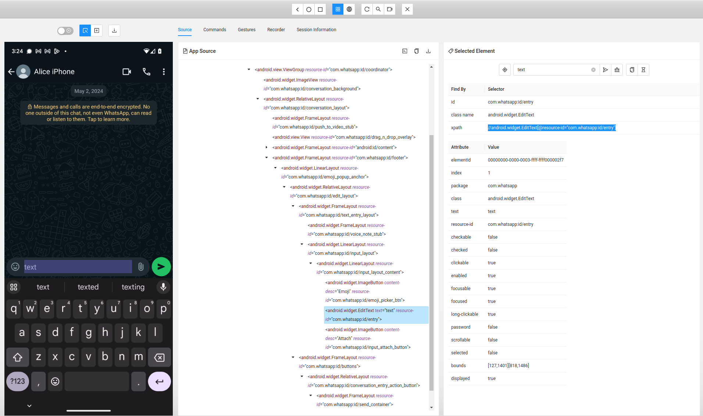

# Contributing to the Appium Automation Project

Thank you for considering contributing to our project! By following these guidelines, you will help ensure that our project remains consistent, maintainable, and easy to use.

## Table of Contents
<!-- TOC -->
* [Contributing to the Appium Automation Project](#contributing-to-the-appium-automation-project)
  * [Table of Contents](#table-of-contents)
  * [Development Installation](#development-installation)
  * [Issues](#issues)
  * [Pull Requests](#pull-requests)
  * [Coding Standards](#coding-standards)
  * [Documentation](#documentation)
    * [App Version Support:](#app-version-support)
  * [StateGraph](#stategraph)
    * [Key Components](#key-components)
      * [States](#states)
        * [SimpleState](#simplestate)
        * [Contextual states](#contextual-states)
      * [Transitions](#transitions)
      * [Actions](#actions)
  * [How to add a new application](#how-to-add-a-new-application)
  * [How to write Appium actions](#how-to-write-appium-actions)
    * [Example: writing new Appium actions](#example-writing-new-appium-actions)
    * [Navigation](#navigation)
    * [Case Sensitivity in XPATH:](#case-sensitivity-in-xpath)
    * [Elements that do not have identifying attributes](#elements-that-do-not-have-identifying-attributes)
  * [Supporting new app versions](#supporting-new-app-versions)
  * [Resources](#resources)
  * [License](#license)
<!-- TOC -->

## Development Installation
To contribute to the project, follow the following installation steps: 

- Follow the installation steps in the [README.md](README.md)
- Install [Appium Inspector](https://github.com/appium/appium-inspector)
- Install Puma by cloning the repository:
```bash
git clone git@github.com:NetherlandsForensicInstitute/puma.git
```
- Create a virtual environment and install Python dependencies:
```bash
cd puma
python3.11 -m venv env
source env/bin/activate 
pip install -r requirements.txt
```

## Issues
- Open an issue for bug reports, feature requests, or general feedback.
- When opening an issue, please provide as much detail as possible, including screenshots, and steps to reproduce for bug reports. If the issue is about a specific app, include its package name and version.


## Pull Requests
- All contributions to the project must be submitted via pull request.
- Ensure that your pull request addresses a specific issue or feature request. If none exists, please open a new issue first to discuss the changes you'd like to make.
- Follow the [GitHub Flow](https://guides.github.com/introduction/flow/) workflow:
  1. Create a new branch from `main`. The branch name should start with the issue number. When adding support for a new
  version of an application, please do this in 1 single issue.
  2. Make your changes and commit them with descriptive commit messages. See the sections [How to add a new application](#how-to-add-a-new-application) or [Supporting new app versions](#supporting-new-app-versions).
  3. Submit a pull request to the main repository's `main` branch.
- Ensure that your code adheres to the project's [coding standards and conventions](#coding-standards).
- Provide a clear and detailed description of your changes in the pull request description.


## Coding Standards
- **PEP Compliance**: Adhere to PEP 8 for code style. Use PEP 484 for typing hints. Refer to the [PEP 8 documentation](https://www.python.org/dev/peps/pep-0008/) for guidelines.
- **Typing Hints**: Use typing hints on all method signatures, including arguments and return values.
- **Documentation**: PyDoc should be in the reStructuredText style, and include the parameters and return value.


## Documentation
- **Pydoc**: Add pydoc to all methods, fully explaining the method, its arguments, and any limitations. Protected methods (prefixed with `_`) do not need documentation.
- **Update App README**: If a new major feature is added (e.g., stickers, pictures, calls), update the application-specific README to reflect these changes.

### App Version Support:
Any pull request to the `main` branch must **fully** support a specific version of the application. (See [Supporting new app versions](#supporting-new-app-versions)) This version should be
newer than the version currently supported by the codebase.

## StateGraph

Puma uses a StateGraph framework for managing UI states and transitions in applications. This approach uses a
state machine pattern to handle navigation and actions within an app, making it more robust and easier to manage
complex interactions.
The StateGraph framework is designed to model the user interface of an application as a graph of states, where each
state represents a screen within the app. Transitions between these states are defined by actions that can be performed
on the UI, such as clicking buttons or navigating menus.

### Key Components
#### States

States represent different screens within the application, for example the conversations screen, the chat screen and the
settings screen.

##### SimpleState

States are usually defined using the `SimpleState` class, which requires a list of XPaths representing elements
that identify the state. The `initial_state` parameter indicates the starting state of the application:

```python
home_state = SimpleState(xpaths=['//android.widget.TextView[@content-desc="Home"]'],
                         initial_state=True)
```

##### Contextual states

A `ContextualState` is a special kind of state that takes context into account when validating the UI. Imagine you're in a
chat application where you have a chat screen for sending messages a contact. If you want to check whether
you're in a chat screen, you can do so, but if you want to check whether you're in a chat screen with a specific person,
you need the context. To achieve this, `ContextualState` expands the `State` class with an additional verification method
named `validate_context`, which has the additional input the validation code needs to validate whether the current screen is
indeed the exact screen we're looking for. Aside from `validate_context`, `ContextualState`s still have a `validate` method, which
should check whether the current screen matches the state, without any context. In the example of the chat state in a
chat app, `validate` should return `True` if we're in ANY chat screen, while `validate_context` should return `True` if we're in the
chat screen with the specified person.

```python
class ExampleAppChatState(SimpleState, ContextualState):
  """
  A state representing a chat screen in the application.
  This class extends both SimpleState and ContextualState to represent a chat screen
  and validate its context based on the conversation name.
  """

  def __init__(self, parent_state):
    """
    Initializes the ChatState with a parent state.

    :param parent_state: The parent state of this chat state.
    """
    super().__init__(xpaths=["xpath1", "xpath2"],
                     parent_state=parent_state)

  def validate_context(self, driver, conversation=None):
    """
    Validates the context of the chat state.

    This method checks if the current chat screen matches the expected conversation name.

    :param driver: The driver instance used to interact with the application.
    :param conversation: The name of the conversation to validate against.
    :return: True if the context is valid, False otherwise.
    """
    if not conversation:
      return True
    return driver.is_present(f'//some_element[@text = "{conversation}"]')
```

In this example, a chat state for a specific application is created by inheriting from both `SimpleState` and
`ContextualState`. This dual inheritance allows the chat state to utilize the fundamental state capabilities provided by
`SimpleState`, while also incorporating the context validation features of `ContextualState`. The `validate_context` method is
crucial here: it ensures that the current context, such as a specific conversation, aligns with the expected context.
This method verifies whether the provided conversation name matches the name of the conversation currently shown on the
screen. (Note: If you wish to implement your own validation method without using SimpleState, you don't need to inherit
from `SimpleState`.)
Below, you can see how you can use the `ChatState`:
```python
conversations_state = SimpleState(["xpath1", "xpath2"], initial_state=True)
chat_state = ExampleAppChatState(parent_state=conversations_state)
```

#### Transitions

Transitions specify the process of moving from one state to another. They are generally made up of a sequence of user
interface actions, such as clicking on specific elements that facilitate the transition to a different state, like
clicking a settings button to navigate to the settings state. These transitions between states are defined using the `to`
method. This method identifies the target state and outlines the necessary actions to achieve that transition.
Typically, these actions are assembled using the `compose_clicks` function, which accepts a list of XPaths to define the
elements that need to be clicked to execute the transition.

```python
home_state.to(to_state=settings_state, ui_actions=compose_clicks(['xpath_button1', 'xpath_button2']))
```

If you're defining a transition to a `ContextualState`, the transition probably needs to know the context to be executed.
In that case you need to define the transition method from scratch, rather than use `compose_clicks`, by defining a method
that takes the required context as an argument: 

```python
def open_chat(driver:PumaDriver, conversation:str):
    driver.click(f'//contact_row[@text="{conversation}"]')

conversations_state = SimpleState(["xpath1", "xpath2"], initial_state=True)
chat_state = ExampleAppChatState(parent_state=conversations_state)

conversations_state.to(chat_state, open_chat)
```
It's crucial that the name(s) of the variable(s) that represent the context match exactly (in the example: the variable
name `conversation`).

#### Actions

Actions are functions that perform specific tasks within a state, such as sending a message or taking a picture. Actions
are associated with states and can be executed when the application is in the correct state. To define these actions,
the `@action` decorator is used. This decorator ties the action function to a specific state, allowing the function to
perform its designated tasks within that state. With this decorator, you don't have to concern yourself with navigating
to the correct state before performing an action, as it ensures the application is in the right state for execution of a
specific action.

```python
@action(settings_state)
def update_settings(self):
  """
  Updates settings in the application.
  """
  self.driver.click('//android.widget.Button[@content-desc="Update Settings"]')
```

When actions are to be performed a `ContextualState`, you need to add the arguments to the method signature, using the
exact same variable names as used in the transition method and the `validate_context` method. Adding a `send_message` method
to our example above looks like this:

```python
@action(chat_state)
def send_message(self, message:str, conversation:str):
  """
  Sends a message to a specific person
  """
  self.driver.send_keys('//text_field', message)
  self.driver.click('//button[@content_desc="Send"]')
```

In this example, the argument `conversation` is not used inside the `send_message` method, but it will be used to properly
navigate to the correct conversation.

### Ground Truth Logging

The State Graph framework contains a Ground Truth Logger with the goal of logging all actions taken on the device. The
framework itself already logs all navigation steps the framework takes, and when actions are called. Therefore, when
implementing a simple application with simple transitions and actions, developers won't need to take the GTL logging
into account.

However, when an application contains complex actions and transitions, it is recommended that the developer logs the
steps taken within these actions or transitions to provide a more granular overview in the logs of which UI actions were
performed on the devices.

For example, if a `take_picture` in a chat app needs to navigate through multiple screens and presses multiple buttons
while also entering text (to include a caption), it is recommended to call the GTL logger to log these steps. Within
a `StateGraph` class, the GTL logger is available by calling `self.gtl_logger`.

The resulting code could look like this:
```python
@action(chat_state)
def take_picture(self, conversation: str, caption: str=None, selfie: bool=False):
    self.gtl_logger.info('Opening camera within chat')
    self.click(ATTACHMENT_BUTTON)
    self.click(CAMERA_BUTTON)
    if selfie:
        self.gtl_logger.info('Reversing camera')
        self.click(SWITCH_CAMERA_BUTTON)
    self.gtl_logger.info('Pressing shutter button to take picture')
    self.click(SHUTTER_BUTTON)
    if caption:
        self.gtl_logger.info('Entering caption text')
        self.enter_text(CAPTION_INPUT, caption)
    self.gtl_logger.info('Pressing send button')
    self.click(SEND_BUTTON)
```

## How to add a new application
When adding support for a new application, make sure to add a new class to the correct location (eg `apps/android`). All
components mentioned in the [Stategraph section](#stategraph) come together in the following class template:
```python
from puma.state_graph.state_graph import StateGraph
from puma.state_graph.state import SimpleState, compose_clicks
from puma.state_graph.action import action

APPLICATION_PACKAGE = 'com.example.app'

class ExampleApp(StateGraph):
    """
    A class representing a state graph for managing UI states and transitions in an example application.
    """

    # Define states
    home_state = SimpleState(xpaths=['//android.widget.TextView[@content-desc="Home"]'],
                            initial_state=True)
    settings_state = SimpleState(xpaths=['//android.widget.TextView[@content-desc="Settings"]'])

    # Define transitions
    home_state.to(settings_state, compose_clicks(['//android.widget.Button[@content-desc="Go to Settings"]']))

    def __init__(self, device_udid):
        """
        Initializes the ExampleApp with a device UDID.

        :param device_udid: The unique device identifier for the Android device.
        """
        StateGraph.__init__(self, device_udid, APPLICATION_PACKAGE)

    @action(settings_state)
    def update_settings(self):
        """
        Updates settings in the application.
        """
        # Perform actions to update settings
        self.driver.click('//android.widget.Button[@content-desc="Update Settings"]')

```
Note that this is a simple example. For a more advanced example using `ContextualState`s, see the [Teleguard
implementation](puma/apps/android/state_graph/teleguard).

The following steps should be taken to implement support for a new application:
- Add the desired functionality (see [the next section](#how-to-write-appium-actions))
- Add a README for this app and add a link to the project README
- Add a test script in the [test scripts directory](test_scripts), in which each function is tested.
- Add your class to the list of apps in [publish_app_tags](.github/scripts/publish_app_tags.py)
- Add the app name to the list of supported apps in the [README](README.md#supported-apps)

## Legacy and deprecation
In Puma 3.0.0, the `StateGraph` was introduced. Before that, a number of applications were already supported, using the
old `AndroidAppiumActions` as an abstract base class. These classes are no longer maintained, and they are marked using
the `@deprecated` decorator. If you want to add new functionality to these classes, please rewrite it to the Puma `StateGraph`,
and add the functionality using the new framework.

## How to write Appium actions
Appium is a framework for testing applications, based on Selenium. In this project, we use Appium to execute actions on the device.
In this context, we define functions in Python that exist of one or more `Appium actions`. An Appium action is a one
action on the phone, for instance tapping on an element. In our Python code, we define functions executing one or more
Appium actions, for instance `send_message()` where the message box is tapped, text is added to the box and the send button is clicked.(See example below)
When supporting different apps of the same type, for instance chat apps, these function need to be implemented for each
app, as the specific elements differ for each application.
So, Telegram has a `send_message` function, and WhatsApp has a different `send_message` function.

### Example: writing new Appium actions
- Start both Appium and Appium Inspector
- Connect your device and start a session with the application. Use the following capability set template and fill in your UDID (run `adb devices`):
    ```json
    {
      "platformName": "Android",
      "appium:options": {
        "automationName": "UiAutomator2",
        "platformVersion": "16.0",
        "deviceName": "Android",
        "udid": "FILL IN YOUR UDID HERE",
        "noReset": true
      }
    }
    ```
- Use Appium Inspector to identify UI elements. For example, to inspect the text box for sending a message, click on the
element in the phone display. In the middle pane, the element is highlighted in the xml tree. In the right pane, all attributes of the element are shown.

- Choose a unique attribute to select the element on. `content-desc` is the preferred attribute, but is not always
present. In this case, choose the resource id with value `com.whatsapp:id/entry`. Appium Inspector gives a suggestion
for the xpath to use. If the attribute value is language dependent, (e.g., "send message" vs. "stuur bericht"),
ensure that it supports English.
- Use `by=AppiumBy.XPATH`. There are other options, for instance `AppiumBy.ID`, but `XPATH` is more reliable in our experience.
  - To send a message in Python code, define a function send_message with the following steps:
  - #TODO test
      ```python
    def send_message(text):
        text_box = self.driver.find_element(by=AppiumBy.XPATH, value="//android.widget.EditText[@resource-id='com.whatsapp:id/entry'")
        # Type text. The keyboard is not part of an application, but is native to the device, hence send_keys is used.
        text_box.send_keys(text)
        #Inspect the Send message button and add
        self.driver.find_element(by=AppiumBy.XPATH, value="//android.widget.ImageButton[@content-desc="Send"]").click()
      ```
- When adding a new function add this function to the test script.

### Navigation
Be aware of navigation within the app. For example, sending message to a specific contact can only be done if currently 
in that chat. Think how this should be handled by the end user and note this in the PyDoc. Code-wise, it is more 
appealing to the end user if the function handles the navigation themselves, for instance by supplying the chat 
contact name as a parameter (see whatsapp.send_message()). However, performance-wise this is not really desirable, 
as for each message sent navigation to the home screen and back into the chat is required. Thus, this is really 
dependent on the situation. The example of WhatsApp mentioned above allows both, so this is a good solution.

### Pop-up handling
By default, Puma handles some predefined pop-ups, most notably permission requests. However, specific apps can have
their own pop-ups. To make sure Puma can handle those, you can add a `PopUpHandler` to your application implementation.
This can be done in the following manner in the `init` of your application:
```python
self.add_popup_handler(PopUpHandler(['/xpath/for/recognition', '/xpath/recognition'], ['/xpath/for/dismissal']))
```
There is also a convenience method `simple_popup_handler`, which only requires a single XPath expression that is used
for recognition and dismissal and returns a `PopUpHandler`.

### Case Sensitivity in XPath:
XPath is case-sensitive by default. As the element attribute values regularly change, and sometimes the only change is
casing, use case insensitivity as much as possible. To make an XPath expression case-insensitive, you can do the
following:
  ```xpath
  //*[lower-case(@attribute) = 'value']
  ```

### Elements that do not have identifying attributes
For some apps, the elements do not have any identifying attributes. In that case, you can use the OCR util function
`click_text_ocr()` from the `appium_util`. This code uses OCR to identify text on a screenshot of the phone, and clicks on the corresponding
coordinates. Note that this is not the preferred way, but sometimes this is inevitable.

> :warning: The `click_text_ocr()` method can only click on single words, as the underlying OCR tool (tesseract) can only recognize single words and not sentences.
> Keep this in mind when writing code: for example, if you want to click the text `continue game`, you need to call `click_ocr('continue')`.


## Supporting new app versions
When you notice the code no longer works on a newer app version, you can update the code to work for the new version.
- To diagnose which functionality does not work anymore for the new version, run the <TODO test script>, which verifies
each function for an app and reports which ones do not work anymore. Make sure to run it after you have finished as well.
- Make sure that all functions in the application class for the specific app version works again, also when you might only be interested in some
of them. For example, when you have a script that sends a few messages and you want to update this in the Appium code
for WhatsApp, also make sure sending a picture and calling still works.
- The most common cause for the code not working for a specific app version anymore is the change of an attribute value.
For example, the resource id for the WhatsApp text box changed from `com.whatsapp:id/entry` to `com.whatsapp:id/whatsappEntry`.
This needs to be updated in the xpath used to find the element.
- **Do not make the code backwards compatible with older versions**, just update the code to work for the new version.
This ensures the code remains readable. For older versions the user can go back to a dedicated release for that version.
- Also perform the following actions:
  - Update the version annotation in the class
  - Refer to the test script provided in our repository for guidelines on creating these tests.


## Resources
- XPATH is a powerful selector for XML documents. Learn about XPATH syntax from resources like [W3Schools XPATH Tutorial](https://www.w3schools.com/xml/xpath_intro.asp).
- Appium is an open-source project and ecosystem of related software, designed to facilitate UI automation of many app platforms. See the [Appium website](http://appium.io/docs/en/latest/).


## License
By contributing to this project, you agree that your contributions will be licensed under the project's [LICENSE](LICENSE.txt).