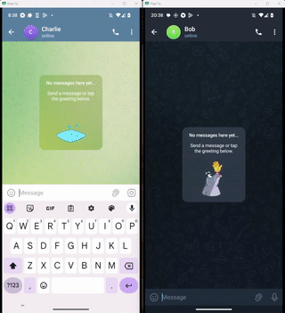

# Puma - Programmable Utility for Mobile Automation

Puma is a Python library for executing app-specific actions on mobile devices such as sending a message or starting a
call. The goal is that you can focus on *what* should happen rather than *how* this should happen, so rather than write
code to "tap on Bob's conversation on Alice's phone, enter the message, and press send", you can simply write "send a
Telegram message to Bob from Alice's phone".



See the full demo video [here](https://archive.org/details/puma-demo-2025).

To execute actions on the mobile device, Puma uses [Appium](https://appium.io/), and open-source project for UI
automation.

Puma was created at the NFI to improve our process of creating test and reference datasets. Our best practices on
creating test data can be found [here](docs/TESTDATA_GUIDELINES.md). If you are wondering whether you should make your
own test data, or whether you should use Puma for it, [this document](docs/TESTDATA_WHY.md) goes into the advantages of
doing so.

Puma is an open-source non-commercial project, and community contributions to add support for apps, or improve support
of existing apps are welcome! If you want to contribute, please read [CONTRIBUTING.md](CONTRIBUTING.md).

## Supported platforms

| Platform | Devices                    | Runs on               | Setup                                   |
|----------|----------------------------|-----------------------|-----------------------------------------|
| Android  | Physical devices, emulators | Linux, macOS, Windows | [Setting up Android](docs/setup-android.md) |
| iOS      | Physical devices, simulators | macOS (with Xcode)    | [Setting up iOS](docs/setup-ios.md)         |

## Getting started

1. Install the required software with the installation script for your operating system, see
   [installation](docs/installation.md).
2. Connect your device (or start an emulator or simulator), and get its UDID. See
   [setting up Android](docs/setup-android.md) or [setting up iOS](docs/setup-ios.md).
    - :warning: Make sure the device is set to English!
3. Install Puma. We recommend installing packages within [a Python venv](https://docs.python.org/3/library/venv.html).

```shell
pip install pumapy
```

4. Run Appium. This starts the Appium server, a process that needs to run while you use Puma.

```shell
appium
```

5. Use Puma! The API is the same on both platforms:

```python
from puma.utils import configure_default_logging
configure_default_logging()  # Use Puma's logging configuration. You can also implement your own

# Android
from puma.apps.android.google_chrome.google_chrome import GoogleChrome
android_phone = GoogleChrome("emulator-5554")
android_phone.visit_url_new_tab("example.com")

# iOS
from puma.apps.ios.safari.safari import Safari
iphone = Safari("C14C2402-9144-4BC2-9866-A1DB5AFAD376")
iphone.visit_url_new_tab("example.com")
```

See [using Puma](docs/usage.md) for more examples, and how navigation, contexts and verification of actions work. For a
demo of Puma on iOS in Safari, Contacts and Apple Maps, run `python -m demo.ios_demo --help` from the root of the
repository. For an extensive step-by-step guide on how to use (and develop) Puma, see the
[Puma Tutorial](tutorial/2026/exercises.md).

## Supported apps

The following apps are supported by Puma. Each app has its own documentation page detailing the supported actions with
example implementations. Each version of Puma supports one version of each app, see
[supported versions](docs/usage.md#supported-versions).

| App                                                             | Platform | Supported version     |
|-----------------------------------------------------------------|----------|-----------------------|
| [Google Camera](puma/apps/android/google_camera/google_camera.py) | Android  | 8.8.225.510547499.09  |
| [Google Chrome](puma/apps/android/google_chrome/README.md)      | Android  | 145.0.7632.159        |
| [Google Maps](puma/apps/android/google_maps/README.md)          | Android  | 26.10.01              |
| [Google Play Store](puma/apps/android/google_play_store/README.md) | Android  | 48.3.25-31            |
| [Open Camera](puma/apps/android/open_camera/README.md)          | Android  | 1.55                  |
| [Snapchat](puma/apps/android/snapchat/README.md)                | Android  | 12.89.0.40            |
| [Telegram](puma/apps/android/telegram/README.md)                | Android  | 12.0.1                |
| [TeleGuard](puma/apps/android/teleguard/README.md)              | Android  | 4.0.9                 |
| [WhatsApp](puma/apps/android/whatsapp/README.md)                | Android  | 2.26.2.70             |
| [WhatsApp for Business](puma/apps/android/whatsapp_business/README.md) | Android  | 2.25.24.78            |
| [Apple Maps](puma/apps/ios/apple_maps/README.md)                | iOS      | iOS 26.2              |
| [Contacts](puma/apps/ios/contacts/README.md)                    | iOS      | iOS 26.2              |
| [Safari](puma/apps/ios/safari/README.md)                        | iOS      | iOS 26.2              |

## Documentation

* [Installation](docs/installation.md)
* [Setting up Android devices](docs/setup-android.md)
* [Setting up iOS devices](docs/setup-ios.md)
* [Using Puma](docs/usage.md): examples, navigation, verifying actions and supported versions
* [Logging](docs/logging.md): Puma's logging and the ground truth logger
* [Troubleshooting](docs/troubleshooting.md)
* [Writing Puma apps](docs/writing-apps.md): how Puma apps work, and how to add a new app
* [Test data guidelines](docs/TESTDATA_GUIDELINES.md) and [why make your own test data](docs/TESTDATA_WHY.md)

## Citation
[](https://doi.org/10.1016/j.fsidi.2025.301985)

If you use Puma in your research, please cite our paper:
```bibtex
@article{CLAIJSWART2025301985,
  title = {Automatically generating digital forensic reference data triggered by mobile application updates},
  journal = {Forensic Science International: Digital Investigation},
  volume = {54},
  pages = {301985},
  year = {2025},
  issn = {2666-2817},
  doi = {https://doi.org/10.1016/j.fsidi.2025.301985},
  url = {https://www.sciencedirect.com/science/article/pii/S2666281725001258},
  author = {Angelina A. Claij-Swart and Erik Oudsen and Bouke Timbermont and Christopher Hargreaves and Lena L. Voigt},
  keywords = {Digital forensics, Datasets, Reference data, Data synthesis, Tool validation, Tool testing, Mobile forensics},
  abstract = {Mobile applications are subject to frequent updates, which poses a challenge for validating digital forensic tools. This paper presents an approach to automate the generation of reference data on an ongoing basis, and how this can be integrated into the overall validation process of a digital forensic analysis platform. Specifically, it describes the architecture of the mobile data synthesis framework Puma, shares its capabilities via an open-source project, and shows how it can be used in a tool testing workflow triggered by application updates. The value of this approach is demonstrated with three example use cases, documenting the use of the approach over six months and reporting insights and experiences gained from this integration. Finally, this work highlights additional contributions the proposed approach and tooling could make to the digital forensics community.}
}
```

### Plain text
Claij-Swart, A. A., Oudsen, E., Timbermont, B., Hargreaves, C., & Voigt, L. L. (2025). Automatically generating digital forensic reference data triggered by mobile application updates. Forensic Science International: Digital Investigation, 54(Supplement), 301985. https://doi.org/10.1016/j.fsidi.2025.301985
